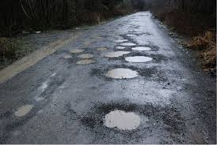
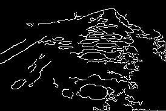

#  Pothole Detection using Image Processing

##  Overview

This project detects potholes in road images using basic image processing techniques in Python. It applies edge detection to highlight potential pothole regions.

The system uses **OpenCV** to process images and identify edges, which can help in detecting irregularities like potholes on road surfaces.

---

##  Features

* Load and process road images
* Convert images to grayscale
* Apply Gaussian blur for noise reduction
* Detect edges using Canny Edge Detection
* Display processed output highlighting pothole-like regions

---

##  Technologies Used

* Python
* OpenCV (`cv2`)
* NumPy

---

## 📂 Project Structure

```
Pothole-Detection/
│
├── pothole.py        # Main script
├── pot.jpg           # Input image
└── README.md         # Documentation
```

---

##  Installation

1. Clone the repository:

```bash
git clone https://github.com/your-username/pothole-detection.git
cd pothole-detection
```

2. Install dependencies:

```bash
pip install opencv-python numpy
```

---

##  Usage

1. Place your image in the project directory.

2. Update the image path in the script if needed:

```python
image_path = 'path_to_your_image'
```

3. Run the script:

```bash
python pothole.py
```

4. The output window will display detected edges.

---

##  How It Works

1. **Image Loading**
   Reads the input image from the given path.

2. **Grayscale Conversion**
   Simplifies the image by removing color information.

3. **Gaussian Blur**
   Reduces noise to improve edge detection.

4. **Canny Edge Detection**
   Detects edges where intensity changes sharply.

---
## Input
 
## 📸 Output


---

##  Limitations

* This method only detects edges, not actual potholes explicitly
* Performance depends on lighting and image quality
* Not suitable for real-time or high-accuracy detection

---

##  Future Improvements

* Use Deep Learning (CNN) for better accuracy
* Real-time pothole detection using video
* Integration with GPS for smart road monitoring
* Classification of pothole severity

---
## Author
Anushka Gunjal 
